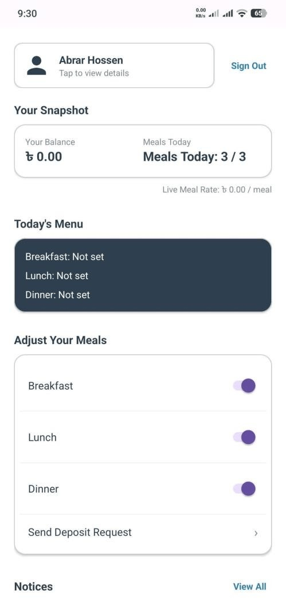
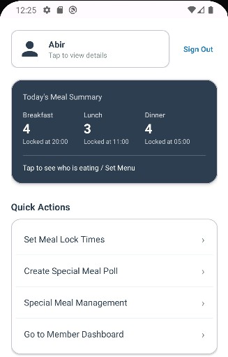
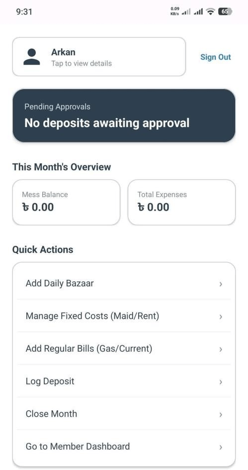
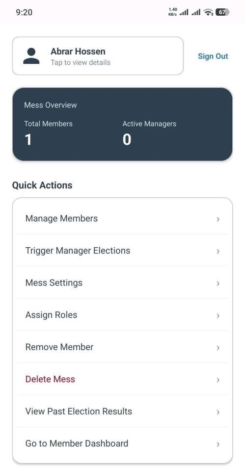
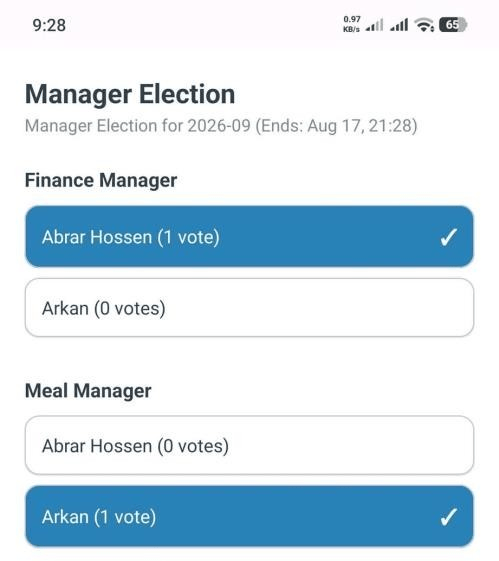

#  MessManager — Advanced Shared Accommodation Management System


**MessManager** is a highly scalable, role-based native Android application engineered to automate and modernize communal living ('Mess') operations in South Asia. By replacing error-prone manual spreadsheets with a transparent, cloud-backed digital platform, it resolves bitter financial disputes, uncontrollable food wastage, and unfair administrative burdens.

---

##  Core Features & Role-Based Access (RBAC)

The system introduces dynamic roles to distribute management responsibilities effectively:

*   **Super Admin:** Manages mess configurations, approves/rejects new join requests, assigns roles, and triggers democratic manager elections.
*   **Finance Manager:** Executes the 'Close Month' audit routine, manages shared utility bills, logs daily market expenses, and approves cash deposits.
*   **Meal Manager:** Oversees universal meal demand, enforces strict cut-off lock times (to prevent food waste), sets daily menus, and orchestrates Special Feast (e.g., Biryani) polls.
*   **General Member:** Views live personal balances, toggles daily meals (before lock deadlines), casts votes in elections, and submits deposit requests.

---

##  Dynamic Financial Calculation Engine
Unlike static apps, MessManager computes live balances on-the-fly to ensure absolute financial transparency. 

*   **Dynamic Meal Rate:** `R_meal = (Total Standard Bazaar Expenses) / (Total Standard Meals Consumed in Month)`
*   **Equal Fixed Utility Share:** `S_fixed = (Total Shared Bills) / (Approved Members)`
*   **Special Meal Share:** Billed strictly to participating members of opt-in polls.
*   **Live Net Balance:** `Opening Balance + Approved Deposits - (Meal Cost + Fixed Share + Special Share)`

---

##  Application Interface

<table>
  <tr>
    <td align="center"><br><b>General Member Dashboard</b></td>
    <td align="center"><br><b>Meal Manager Overview</b></td>
    <td align="center"><br><b>Finance & Audit Dashboard</b></td>
  </tr>
  <tr>
    <td align="center"><br><b>Super Admin Governance</b></td>
    <td align="center"><br><b>Democratic Election Ballot</b></td>
  </tr>
</table>

---

##  Technical Architecture & Stack

MessManager is built following the official **Android Architecture Guidelines** to ensure a clean separation of concerns:

*   **UI & Navigation:** Single-Activity Architecture, Jetpack Navigation Component, Material Design 3, ViewBinding.
*   **Presentation Layer:** MVVM (Model-View-ViewModel) with Unidirectional Data Flow using immutable Kotlin `StateFlow`.
*   **Concurrency:** Kotlinx Coroutines with structured concurrency (`viewModelScope`, timeouts, `repeatOnLifecycle`).
*   **Data & Cloud:** Google Cloud Firestore (NoSQL Persistent Ledger), Firebase Authentication, Firebase Cloud Storage.
*   **Performance:** Implements deterministic document indexing (Composite keys: `userId_date_mealType`) to prevent duplicate entries and offline data persistence.

---

##  Installation & Setup

1. **Clone the repository:**
   ```bash
   git clone [https://github.com/ArmansHub/MessManager.git](https://github.com/ArmansHub/MessManager.git)
   ```
2. Open the cloned directory in **Android Studio**.
3. Place your `google-services.json` file inside the `app/` directory to connect your Firebase instance.
4. Sync Gradle dependencies and run the application on an emulator or physical device.

---

>  **Deep Dive:** For a complete breakdown of the Cloud Firestore schema, RBAC matrix, calculation algorithms, and detailed workflows, please read the [Detailed Technical Documentation (DETAILS.md)](DETAILS.md).